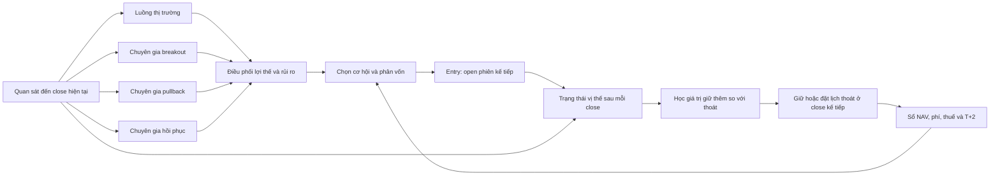

# ML lướt sóng: quyết định theo nhiều luồng

Ngày: **03/10/2026**. Workspace: **D:\AIInvest**. PR: [#15](https://github.com/thanhtai040805/AI_Invest/pull/15).

**Đây là hướng thiết kế mới, thay hướng challenger H3/H5 cố định.** Prototype
đã được code, train và đánh giá offline. Bản đầu **chưa tạo lợi thế có lãi**;
không được đưa vào vận hành giao dịch. Các nghiên cứu H3/H5 cũ được giữ làm
lịch sử thực nghiệm, không tiếp tục làm khuôn kiến trúc cho thiết kế này.

## 1. Bắt đầu từ công việc của người lướt sóng

Một người lướt sóng cần làm được các việc sau:

1. Nhận biết thị trường đang mở cơ hội hay tăng rủi ro.
2. Phân biệt cơ hội tiếp diễn, điều chỉnh trong xu hướng và hồi phục sau bán tháo.
3. Ước lượng lợi thế sau phí, thuế, giá khớp và thời gian vốn bị giữ.
4. Chọn cơ hội đáng dành vốn; có thể đứng ngoài khi lợi thế không dương.
5. Sau khi mua, cập nhật xem giữ thêm còn có giá trị hơn thoát hay không.
6. Theo dõi danh mục và thực thi lệnh bằng tiền/chứng khoán thật sự khả dụng.

Đây là các vai trò thiết kế, chưa phải khẳng định rằng mô phỏng hành vi của
người giao dịch tự động tạo lợi nhuận. Giá trị của từng vai trò phải được đo
bằng NAV và giao dịch sau chi phí trên thời gian chưa dùng để fit nó.



## 2. Những phần thật sự được học

| Vai trò | Mục tiêu học | Thuật toán trong prototype |
|---|---|---|
| Đọc thị trường | Median lợi suất ròng H3 của universe; xác suất lower quartile dưới −2,5% | Ridge và LogisticRegression, một mẫu cho mỗi ngày |
| Breakout | Payoff, xác suất lãi, downside và thời gian giữ dưới chính sách thoát đã đóng băng | LightGBM mean/quantile; logistic; Ridge duration |
| Pullback | Cùng đại lượng kinh tế, trên các sự kiện điều chỉnh trong xu hướng | Ridge mean/duration; logistic; LightGBM quantile |
| Hồi phục | Cùng đại lượng kinh tế, trên sự kiện hồi phục sau giảm mạnh | LightGBM mean/quantile; logistic; Ridge duration |
| Quản lý vị thế | Giá trị tăng thêm của HOLD so với bán ở close kế tiếp | Bốn hồi quy LightGBM theo tuổi vị thế, học ngược từ giới hạn giữ |
| Điều phối | Payoff ròng từ dự báo của các chuyên gia đã đóng băng và market context | LightGBM mean/quantile; logistic; Ridge duration, calibration trên block sau |

Các chuyên gia học trên tập sự kiện khác nhau, có thể cùng hoạt động tại một
mã/ngày. Không giả định chúng độc lập thống kê. Nếu một chuyên gia có dưới
80 mẫu trong block fit, nó được ghi là **inactive**; không tạo dự báo giả để
đủ số lượng mô hình. Hồi phục có rất ít mẫu ở nhiều quý 2024–2026.

Ba loại sự kiện dùng thông tin đã có tại close:

- **Breakout:** vượt high của 20 phiên trước, volume ratio ≥1,2, close ở ≥65%
  biên ngày, trên MA20.
- **Pullback:** return20 >2%, return3 <0, không thấp hơn MA20 quá 2%, phiên
  hiện tại tăng từ open và close ở ≥55% biên ngày.
- **Hồi phục:** return5 ≤−4%, return1 >0, đảo chiều3 >0, close ở ≥65% biên
  ngày, volume ratio ≥1,2.

Đây là định nghĩa giả thuyết đầu tiên, đã ghi trước khi mở báo cáo thực nghiệm.
Chúng không phải chân lý về thị trường và chưa chứng minh được lợi nhuận.

## 3. Học giữ/thoát mà không biết trước giá đẹp nhất

Quyết định entry sau close t, fill proxy tại raw open t+1. Vị thế tính tuổi
từ phiên entry: quyết định sau close ở tuổi 2 có thể bán ở **close kế tiếp,
tuổi 3**. Giới hạn dự kiến là tuổi 7. Daily high/low không tạo nhãn khớp stop
trong ngày vì chưa có thứ tự giao dịch thực tế.

Tại tuổi h, mô hình học:

```text
continuation_advantage_h = realized_return_under_frozen_later_age_policy
                           − return_if_sold_at_next_close_h_plus_1

HOLD nếu predicted advantage > 0; EXIT nếu <= 0.
```

Payoff là lợi suất toàn giao dịch sau proportional costs. Chi phí entry đã
phát sinh được giữ giống nhau ở hai vế. Target không lấy max future close.
Trạng thái gồm PnL hiện tại, peak theo các close đã quan sát, drawdown, tuổi,
setup ban đầu và feature thị trường/cổ phiếu hiện tại. Nếu trạng thái hiện
tại thiếu thì tiếp tục chờ quyết định hợp lệ hoặc lịch thoát tối đa.

Tách thời gian bên trong phần học thoát tránh việc dùng prediction trên chính
paths vừa fit để tạo target cho tuổi kế tiếp. Tuổi 5 học trước; tuổi 4 học
trên paths mới với tuổi 5 đóng băng; tuổi 3 và 2 tiếp tục như vậy. Vì thế
head tuổi 5 có dữ liệu cũ hơn head tuổi 2; mẫu, số ngày và cutoff riêng đều
được lưu để nhìn thấy rủi ro drift này.

## 4. Thời gian train: bốn block chính, bốn block thoát

Trước mỗi đầu quý Q, lấy cửa sổ 36 tháng:

| Block | Khoảng trước Q | Việc thực hiện |
|---|---|---|
| A | Q−36 đến Q−12 tháng | Học market context; chia thành bốn band 6 tháng để học exit tuổi 5 →4 →3 →2 |
| B | Q−12 đến Q−6 tháng | Áp dụng frozen A exit lên paths mới; học các chuyên gia từ payoff này |
| C | Q−6 đến Q−3 tháng | Áp dụng frozen A/B; học tầng điều phối từ dự báo trên block mới |
| D | Q−3 tháng đến Q | Calibration probability, mean bias và q10 offset của frozen A/B/C |

Mỗi band yêu cầu **label_end_date H7 nhỏ hơn nghiêm ngặt boundary kế tiếp**.
Không chỉ so ngày feature. Imputer/scaler thuộc từng head và chỉ fit trên
block của head đó. Danh sách feature được kiểm bằng allowlist market/setup/
liquidity và state; không cho thêm cột entry/exit tương lai qua metadata.

Refit toàn bộ theo quý. Vị thế qua biên quý vẫn dùng **artifact của entry**
cho quyết định thoát. Mỗi forecast mang SHA-256 của artifact và
`trained_through`; manifest ghi đường artifact, số mẫu và chính sách binding.

## 5. Điều phối vốn và cách đánh giá lợi nhuận

EV ròng dự báo phải dương để có thể vào lệnh. Ưu tiên theo EV chia cho thời
gian giữ dự báo. Probability được báo cáo; không bắt buộc tỷ lệ thắng >50%.
Marketrisk liên tục giảm risk budget, với floor 25% budget gốc.

Sổ vốn dùng các giả định cố định cho thử nghiệm:

- NAV ban đầu 1 tỷ VND; tối đa 5 vị thế, 10% NAV/mã, risk budget 0,5% NAV/vị thế.
- Ít nhất 10% cash buffer; participation tối đa 1% ADTV20 shares, lot100,
  notional tối thiểu 10 triệu VND.
- Phí mua/bán mỗi chiều 0,1%, tối thiểu 10.000 VND/lệnh; thuế bán 0,1%.
- Friction roundtrip 20bps cơ sở, 100bps stress, cộng ngoài phí/thuế.
- Sale receivable vào tiền khả dụng tại T+2 close, dùng mua từ open tiếp theo.
- Sizing theo NAV close trước; tiền bán cùng phiên không tài trợ entry.

Đây là capital sleeve của nghiên cứu, chưa phải giới hạn vốn được ML tối ưu
hoặc biểu phí/hợp đồng đã xác nhận cho tài khoản môi giới cụ thể. Giá open/
close và continuous volume là proxy khả năng fill, chưa có bằng chứng auction,
depth, queue hay partial fills. Lệnh không có quote hợp lệ được hoãn; giới hạn
dự kiến 7 phiên không tạo một giao dịch bán giả.

Đo toàn bộ NAV theo mọi phiên trong cửa sổ, kể cả khi chưa có signal. Báo
PF/expectancy sau chi phí, DD, tổng lãi chốt dương lần đầu, PnL phiên20,
thời gian giữ thực tế, capital-days, mã/chuyên gia và inventory chưa đóng.
Một giao dịch lãi đầu tiên không đủ chứng minh danh mục có lợi thế.

## 6. Kết quả thực nghiệm đầu tiên

Artifact được báo cáo:
`D:\AIInvest\ai-engine\scratch\broker_swing_research_2026-10-03_v2`.

Một cấu hình mới, 15 lần refit quý; không chọn lại cấu hình theo 2026.
Ba đối chiếu: cùng forecasts entry nhưng exit cố định7; raw specialists bỏ
arbiter và calibration; full model với friction100bps.

| Cửa sổ | Full adaptive | Cùng entry, static7 | Specialists bỏ arbiter | Full stress100bps |
|---|---:|---:|---:|---:|
| DEV2023 | −5,61% | −0,93% | +2,25% | −10,87% |
| DEV2024 | −4,59% | +0,09% | −4,20% | −8,72% |
| DEV2025 | −4,68% | −0,34% | −4,95% | −11,91% |
| 2026 đến 01/10, đã xem trước | −13,59% | −8,35% | −12,08% | −16,85% |

Full DEV: **406 giao dịch, PF 0,6876**, không qua profitability gate.
2026 full: **102 giao dịch**, PF **0,2221**, giữ trung bình **4,34 phiên**;
NAV mất khoảng **135,9 triệu VND trên 1 tỷ**. Đây là diagnostic đã xem trước,
không được gọi là holdout mới. `promotion_status = REJECTED_PROFITABILITY`.

Static7 dùng cùng forecast entry nhưng turnover/cash availability khác nên
số giao dịch thực hiện khác. Đây là kiểm tra tác động exit lên danh mục;
để kết luận về một quyết định thoát cần so cả các entry trùng khóa.
Specialist control bỏ cả arbiter lẫn calibration của arbiter, không phải
một thí nghiệm cô lập chỉ riêng một head.

Kết quả buộc phải xét lại khả năng định giá entry và giá trị continuation,
thay vì mặc định luồng mới nào cũng hữu ích. Thiết kế nhiều luồng đã được
triển khai; lợi thế có lãi vẫn chưa được chứng minh.

### Chẩn đoán DEV: lỗi định giá hành động và tái phân vốn

Đối chiếu 1.050 forecast có EV dương với payoff của frozen policy: mean
predicted **+0,866%**, mean observed **−0,840%**. Cả bốn quartile EV dương
đều có mean outcome âm; tăng threshold trên thang EV này chưa có chứng cứ
chọn được vùng tốt hơn. Trên 406 lệnh nhận, probability trung bình 40,75%
gần win rate 42,12%, nhưng predicted EV +0,837% đối nghịch mean net return
−0,643%. Probability gần đúng về mức trung bình chưa định giá payoff đúng.

Ghép cùng decision date/ticker và định giá exit static với **cùng size và
entry cash cost của lệnh adaptive**, gồm fees/tax/minimum fee:

| DEV | Cặp cùng entry | Delta exit adaptive−static, cùng size | Lệnh chỉ adaptive: số / net PnL |
|---|---:|---:|---:|
| 2023 | 86 | +6,79 triệu VND | 57 / −56,06 triệu VND |
| 2024 | 66 | −20,79 triệu VND | 32 / −12,19 triệu VND |
| 2025 | 88 | −18,81 triệu VND | 77 / −22,87 triệu VND |

Năm 2023, exit trên các cặp cải thiện PnL, nhưng các slot vừa giải phóng
cho phép mua thêm những cơ hội thua lỗ. Pooled 240 cặp có exit delta
−32,81 triệu; khác biệt return trung bình −0,425 điểm %, khoảng bootstrap
moving blocks bốn tuần 95% [−1,231; +0,402] điểm %. Khoảng đi qua 0 nên
chưa đủ để nói mọi learned exit đều có hại. Các counterfactual này cũng
không thể chứng minh lợi nhuận tương lai hoặc tách hoàn toàn selection.

Diagnostic 2026 chốt tổng lãi dương đầu tiên ngày 09/01, nhưng PnL tại phiên20
đã **−7,08 triệu VND** và NAV cuối kỳ **−135,89 triệu**. Điều này cho thấy
phải xét cả vốn được tái sử dụng và kết quả sau mốc lãi sớm.

**Hướng sửa objective được chứng cứ DEV gợi ý:** định giá *incremental value
của hành động trên danh mục*. BUY cần so với giữ cash; EXIT kèm tái phân
vốn cần so với HOLD, gồm slot, settlement và các lệnh tiếp theo được mở nhờ
hành động. Xác nhận/calibrate trên block sau ở chính vùng hành động được
chọn; khi uncertainty chưa phân biệt được thì giữ hành động nền. Đây là
đề xuất cho vòng nghiên cứu kế tiếp, **chưa được implement hoặc chứng minh**
trong prototype đầu. Sổ vốn hiện tại là allocator có giới hạn; nó chưa học
counterfactual cấp danh mục. Thêm thuật toán không tự sửa được objective này.

## 7. Dữ liệu và giới hạn có ảnh hưởng đến kết luận

Nguồn: snapshot PROD đã xuất read-only ngày 02/10/2026, **1.011.757 bar,
407 mã cổ phiếu**, 2015–01/10/2026. SHA-256:
`dd89de0d85fe6b454584a62ef66fe14bdb045b68144d41d58fd18d7dbb8973d1`.

Raw OHLC không nhất quán ở 2.884 row được cách ly bằng NaN; 35 ngày stock
có mặt nhưng thiếu VNINDEX chỉ thêm calendar placeholder không có giá. Dataset
mới có 1.008.861 stock rows, 84.241 state rows; event counts toàn lịch sử:
breakout8.612, pullback7.291, reversal1.048. Các universe/events chỉ dùng
quan sát tại ngày quyết định, không lọc theo outcome tương lai.

Adjusted OHLC tạo feature; raw OHLC tạo tiền và fills. Snapshot hiện tại chưa
chứng minh lịch sử publication/revision, danh sách niêm yết/hủy niêm yết theo
thời điểm hoặc quyền corporate actions. PnL raw chưa cộng cash/stock/rights
entitlements. Không dùng thay đổi factor tương lai để loại giao dịch bất lợi.
Không dùng dữ liệu foreign flow nếu export không cung cấp.

Supervised labels yêu cầu cả path7 phiên hợp lệ. Điều này có thể loại một path
đã bán được ở H3 nhưng mất bar/liquidity ở H6/H7: **informative censoring**,
không phải quyền biết trước tương lai cho quyết định. Forecast và ledger vẫn
nhận các candidate tương lai censored. Bước cải thiện dữ liệu cần phân biệt
outcome quan sát được tại exit thật của frozen policy với phần path về sau.

## 8. Mã nguồn, lệnh chạy và kiểm tra

| Thành phần | Nguồn |
|---|---|
| Dataset mới | [broker_swing_dataset.py](../../ai-engine/experiments/broker_swing_dataset.py) |
| Mô hình và temporal policy | [broker_swing_model.py](../../ai-engine/app/domain/services/ml/broker_swing_model.py) |
| Sổ vốn và thực thi giả định | [broker_swing_portfolio.py](../../ai-engine/experiments/broker_swing_portfolio.py) |
| Protocol, train, ablations | [research_broker_swing.py](../../ai-engine/scripts/research_broker_swing.py) |

```powershell
Set-Location D:\AIInvest\ai-engine
python -u scripts/research_broker_swing.py `
  --bars scratch/short_horizon_daily_bars_2026-10-02.csv.gz `
  --output scratch/broker_swing_research_2026-10-03_v2 `
  --allow-missing-index-sessions --n-jobs 4
```

Output phải rỗng khi bắt đầu. Protocol ghi source/code SHA trước khi train;
JSON/parquet/CSV giữ forecasts, states, policy outcomes, NAV, trades và model
artifacts. Artifact nghiên cứu nằm ở D; không được đóng gói như model production.
Standalone ML hiện tại và SAG không được kết nối vào thiết kế thử nghiệm này.

Focused tests kiểm causal feature/event independence, label censoring, temporal
purge, stopping recursion, entry-artifact binding, T+2, phí, sizing, hoãn exit,
clock lợi nhuận và artifact roundtrip. Runtime Python hiện có NumPy2.5 khiến
joblib phát deprecation warning khi reshape array; các roundtrip kiểm vẫn pass.

**76 focused tests pass:** 54 test của hướng mới và 22 regression của
challenger trước. Ruff E9/F63/F7/F82 pass trên bốn module mới và các tests.
`evidence_check.json` trong artifact v2 xác nhận source/code/model SHA,
cutoff trước decision và cùng entry/exit artifact ở cả bốn cửa sổ đánh giá.

## 9. Cơ sở nghiên cứu và phần suy luận của dự án

- Phân biệt setup từ price/volume là giả thuyết có thể kiểm tra. Nghiên cứu
  [Lo–Mamaysky–Wang](https://www.mit.edu/~wangj/pap/LoMamayskyWang00.pdf)
  tìm incremental information từ một số mẫu trên dữ liệu Mỹ; không xác nhận
  lợi nhuận ròng tại Việt Nam cho ba event của prototype.
- Ý tưởng hồi quy conditional continuation mượn từ
  [Longstaff–Schwartz](https://escholarship.org/uc/item/43n1k4jb), vốn nghiên
  cứu American option exercise. Áp dụng cho giữ/thoát cổ phiếu là suy luận
  thiết kế của dự án, không phải kết quả đã được paper xác nhận.
- Chi phí và tốc độ decay cần đi vào lựa chọn vốn. Xem
  [Gârleanu–Pedersen](https://www.nber.org/papers/w15205) và dữ liệu giao dịch
  thực tế trong [Trading Costs](https://www.aqr.com/Insights/Research/Working-Paper/Trading-Costs).
- [Gu–Kelly–Xiu](https://www.nber.org/papers/w25398) nghiên cứu nonlinear
  interactions trong dự báo risk premia. Điều đó hỗ trợ thử interaction
  context/setup, chưa chứng minh tín hiệu ngắn hạn ở snapshot này.

Sáng tạo nằm ở cách định nghĩa các quyết định và vai trò có thể học. Tiêu chí
đánh giá tiếp tục là lợi nhuận ròng quan sát được, thời gian vốn, tail risk
và độ tin cậy trên dữ liệu mới.
